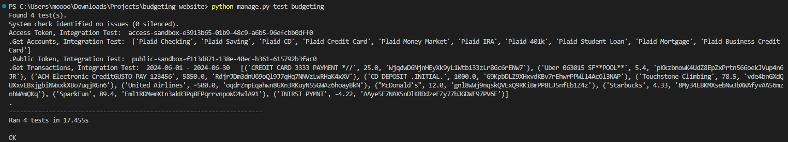

# budgeting-website
<!-- TABLE OF CONTENTS -->
<details open="open">
  <summary><h2 style="display: inline-block">Table of Contents</h2></summary>
  <ol>
    <li>
      <a href="#about-the-project">About The Project</a>
      <ul>
        <li><a href="#built-with">Built With</a></li>
      </ul>
    </li>
    <li><a href="#contact">Contact</a></li>
  </ol>
</details>

<!-- ABOUT THE PROJECT -->
## About The Project

* A Django app used to retrieve budgeting information securely through Plaid
* Create User -> Make a POST request at /register-user/ with email and password to create new user.
* Login -> Make a POST request at /login/ with email and password. Returns a token if login is successful and is_logged_in is set to true.
* Logout -> Make a POST request at /logout/ with the token generated at login. is_logged_in is set to false.
* Token Exchange -> Make a GET request at /token-exchange/ with email and public_token. Returns access_token if not generated already.
* Get Transaction -> Make a GET request a /get-transactions/ with email, start_date and end_date. Returns transactions within given time period.
* Get Accounts -> Make a GET request at /get-accounts/ with email. Return user accounts.
* Update Transaction -> Make a POST request at /update-transactions/ with user email and transaction id. Fetches the transaction. Updates user by sending email.



### Built With

* Python
* Django
* Celery
* AMQP
* Plaid

<p align="right">(<a href="#budgeting-website">back to top</a>)</p>

### Budgeting Website
Install dependencies
```pip install django```
```pip install celery```
```pip install plaid-python```
```pip install amqp```
Make migrations
```python manage.py makemigrations```
```python manage.py migrate```
Run the server with
```python manage.py runserver```
Run the test with
```python manage.py test budgeting```
Open Command Prompt
```cd C:\Users\YOUR_USERNAME_HERE\Downloads\rabbitmq-server-windows-3.13.3\rabbitmq_server-3.13.3\sbin```
```rabbitmq-server.bat```
Start Celery Service
```python -m celery -A budgetingwebsite.celery_app worker -l info```

?raw=true)

<p align="right">(<a href="#budgeting-website">back to top</a>)</p>

<!-- CONTACT -->
## Contact

Email: meganle414@gmail.com

Project Link: [https://github.com/meganle414/budgeting-website](https://github.com/meganle414/budgeting-website)

[linkedin-url]: https://linkedin.com/in/meganle414/

<p align="right">(<a href="#budgeting-website">back to top</a>)</p>
